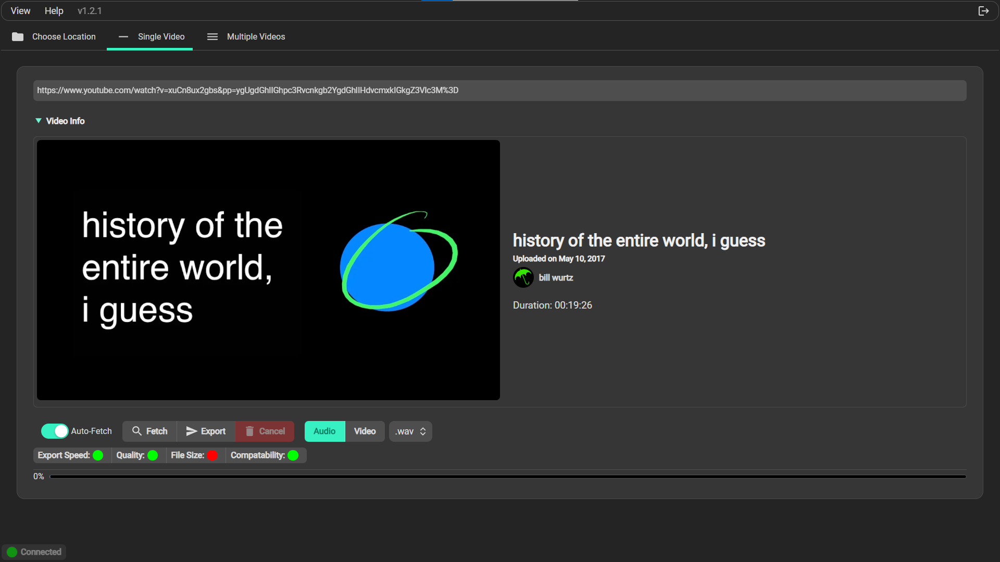
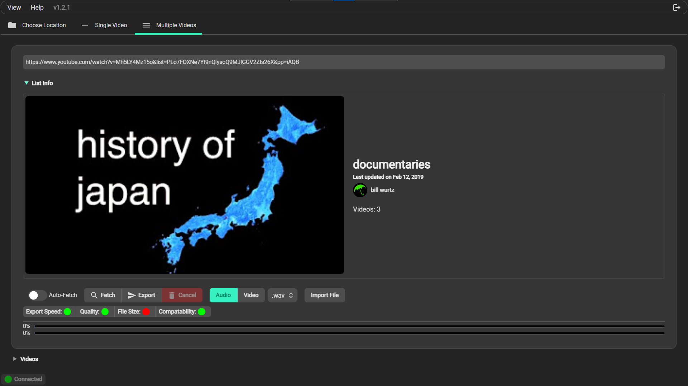

# YTConvert Version 2

## About

YTConvertV2 is an application written using [ElectronJS](https://www.electronjs.org), to extract audio (and soon video) from youtube videos, and convert them to files on your computer.

## Features

### Video Extractor

Convert any available video to an audio file at your desired location.

### Playlist Extractor

Convert an entire playlist worth of videos into multiple audio files at the click of a few buttons!

### Version Warnings

YTConvertV2 will automatically fetch the most recent release, and warn you if your version is out of date.

## Install

1. Go to the [latest release](https://github.com/GlitchlessCode/ytconvertv2/releases/latest), and download the installer for your operating system (.dmg for Mac, .exe for Windows).
2. Once downloaded, run the installer
   - On Windows, the installer will simply run, and then open the application afterwards. It's now installed on your computer!
   - On Mac, the .dmg will run, but you must add it your Applications folder, by dragging and dropping.
3. Congrats! The application is now installed!

_Dev Note: Your computer may warn you that it was downloaded from the internet, but there are easy ways to bypass that._

## More Coming Soon!

I'm planning to add more features to YTConvertV2 soon, here are some of the upcoming features:

- Option to convert to .mp4
- Option to change video(s)/playlist title before extract
- Extract a list of videos from a .txt file

as well as bug fixes, general improvements, and dependency fixes.
