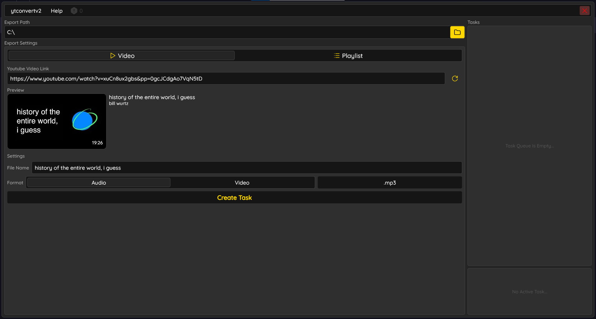
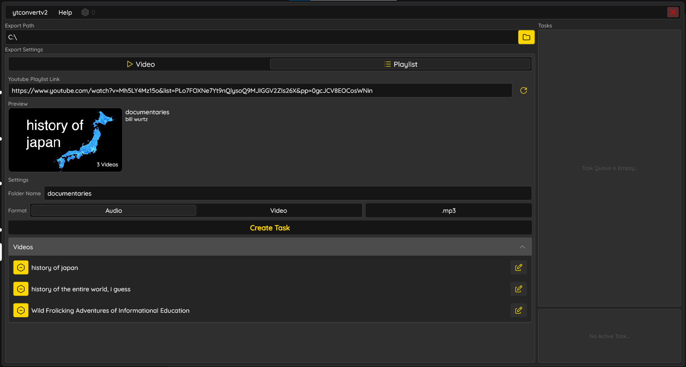

> [!WARNING]
> This repository is henceforth archived and will not be updated. Please be aware that it may be made private at any time.

<h1 align="center">YTConvert</h1>

  
  
  
  

`ytconvertv2` is an app which provides a nice visual wrapper around [`yt-dlp`](https://github.com/yt-dlp/yt-dlp) and
[`ffmpeg`](https://ffmpeg.org/), in order to extract audio and video from YouTube videos in a variety of file formats.

## Table of Contents

- [Table of Contents](#table-of-contents)
- [Installation](#installation)
- [Support Me](#support-me)
- [Features](#features)
  - [Video Extraction](#video-extraction)
  - [Playlist Extraction](#playlist-extraction)
  - [Automatic Updates](#automatic-updates)
- [Improvements Over 1.x.x](#improvements-over-1xx)
  - [Task Queue](#task-queue)
  - [File Pre-Naming](#file-pre-naming)
  - [Automatic Dependency Updates](#automatic-dependency-updates)
  - [Better Error Handling](#better-error-handling)
- [License \& Legal Disclaimer](#license--legal-disclaimer)

## Installation

Download the installer for your platform from the table below and run it. Currently only x86_64 builds are produced,
and arm64 is unsupported.

_Note: For MacOS users, the first time you try to open the app, it may be quarantined by MacOS, because it's downloaded from the_
_internet. To open it, right-click the application and choose "Open"_

<table align="center">
<thead>
<tr>
<th align="center">Operating System</th>
<th align="center">Download</th>
</tr>
</thead>
<tbody>
<tr>
<td align="center">MacOS</td>
<td align="center"><a href="https://www.github.com/GlitchlessCode/ytconvertv2/releases/latest/download/ytconvertv2-osx-Setup.dmg">Download <code>ytconvertv2-osx-Setup.dmg</code></a></td>
</tr>
<tr>
<td align="center">Windows</td>
<td align="center"><a href="https://www.github.com/GlitchlessCode/ytconvertv2/releases/latest/download/ytconvertv2-win-Setup.exe">Download <code>ytconvertv2-win-Setup.exe</code></a></td>
</tr>
</tbody>
</table>

## Support Me

If you find this tool helpful, consider supporting future development:

## Features

### Video Extraction

`ytconvertv2` can extract any publicly available YouTube video in several audio and video formats! Is the
format you want missing? Recommend it [here](https://github.com/GlitchlessCode/ytconvertv2/issues/new?template=feature_request.yml)!

### Playlist Extraction

`ytconvertv2` can also extract entire playlists at a time! Just plug in the link, and let it run.

### Automatic Updates

Updates for `ytconvertv2` have never been easier! All dependencies are automatically fetched, and the app automatically
fetches the most recent version on startup. Powered by [Velopack](https://velopack.io/), `ytconvertv2` should no longer
require you to manually go download a new version ever again.

## Improvements Over 1.x.x

The 2.0.0 release of `ytconvertv2` comes with whole slew of major user experience improvements! Enjoy!

### Task Queue

Queue up multiple extraction tasks, both videos and playlists, in any format, and then just let `ytconvertv2` work in the
background.

### File Pre-Naming

All outputs can now be pre-named to a different name, should you so desire! Name anything and everything however you please.

### Automatic Dependency Updates

The rewrite of `ytconvertv2` now acts as a wrapper for [`yt-dlp`](https://github.com/yt-dlp/yt-dlp), and as such, can
update [`yt-dlp`](https://github.com/yt-dlp/yt-dlp) separately from `ytconvertv2`, creating a more resilient app
experience. The need for developer intervention to update dependencies should be drastically reduced, which helps both
you and me.

### Better Error Handling

Errors should almost never cause the program to crash anymore! A new error menu has been added, where errors can and
will be reported.

## License & Legal Disclaimer

This software is provided under the [MIT License](./LICENSE). However, the following additional terms and disclaimers
apply specifically to its use:

1. **Third-Party Dependencies**

   This software utilizes third-party tools and libraries including [`yt-dlp`](https://github.com/yt-dlp/yt-dlp),
   [`ffmpeg`](https://ffmpeg.org/), and various Rust crates for media extraction and conversion. These tools are
   included or referenced under their respective open-source licenses. The developer of this application is not
   affiliated with, nor responsible for, the development or maintenance of those projects.

2. **Intended Use**

   This application is intended solely as a general-purpose, **personal-use tool**. It does not facilitate or encourage
   the downloading of copyrighted or infringing content, nor is it designed with the intent to violate any intellectual
   property laws. Its primary purpose is to provide users with the ability to manage and convert media they have legal
   access to, including, but not limited to publicly available videos, self-created content, or content distributed under
   open licenses.

   The developer neither endorses nor assumes responsibility for the ways in which users utilize this tool. It is the
   user’s responsibility to ensure they possess the legal rights to download or convert any content. Use of this software
   for the unauthorized acquisition or redistribution of copyrighted material is **strictly discouraged**.

3. **Responsibility of Use**

   Users are solely responsible for how they choose to use this software. Downloading copyrighted content without
   appropriate rights or permission may violate the laws of your country and/or the Terms of Service of YouTube.

   The developer expressly disclaims any liability for actions taken by users in violation of such laws or terms.

4. **No Association with YouTube or Google**

   This application is not affiliated with, endorsed by, or connected to YouTube, Google, or any of their subsidiaries.
   Use of this tool may violate YouTube’s Terms of Service, and could result in actions against user accounts by those
   entities.

5. **Developer Affiliation And Stance**

   The developer is not affiliated with, nor does the developer endorse, any particular use case by end users. The
   developer does not publicly condone or encourage piracy or unlawful behavior, and no endorsement should be inferred
   from the availability of this software.

   Users are solely responsible for ensuring that their use of the application complies with all applicable laws and
   respects the rights of content owners. Any legal liability arising from misuse of this software rests entirely with
   the user.
